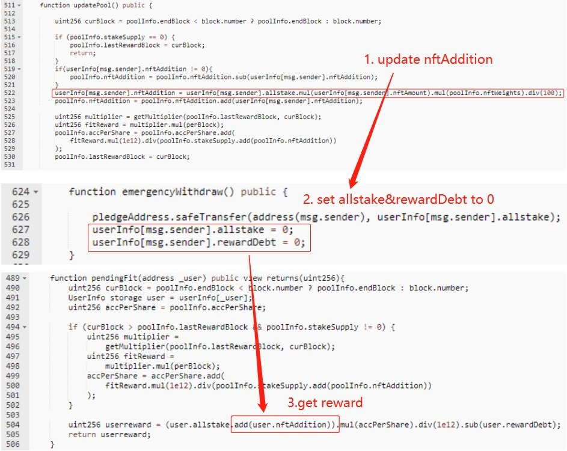
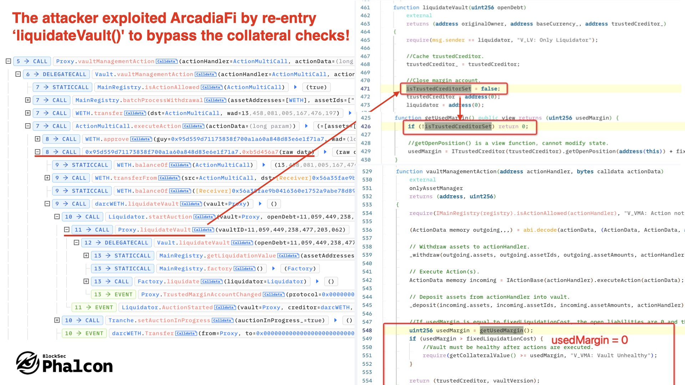
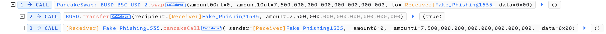
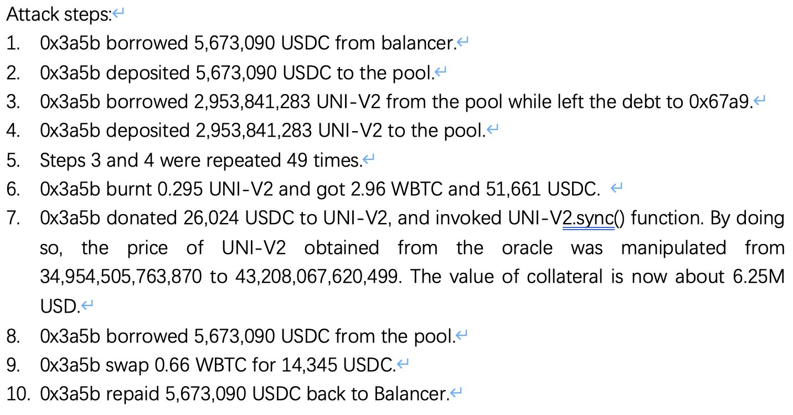
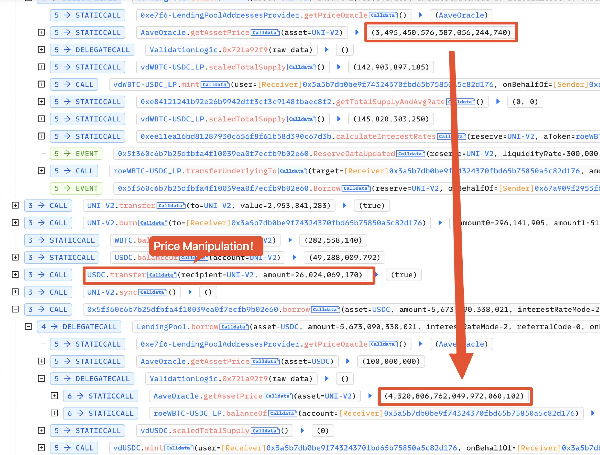
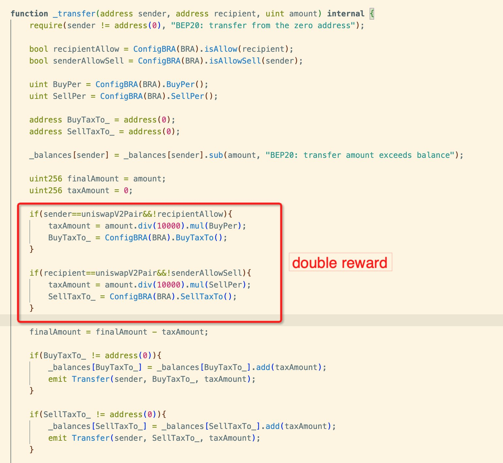

# Web3 Hacks

复现下 Web3 上以往的攻击事件,学习 Web3 安全审计

- 2023

  [2023-07-18 BNO](#2023-07-18-bno)

  [2023-07-10 Arcadia Fiance](#2023-07-10-arcadia-fiance)

  [2023-04-02 AllBridge](#2023-04-02-allbridge)

  [2023-01-12 ROE](#2023-01-12-roe)

  [2023-01-10 BRA](#2023-01-10-bra)

- 2022

  [2023-01-10 Nomad Bridge](#2022-08-01-nomadbridge)

---

## 2023-07-18 BNO

[BNO 攻击复现](./test/BNO.exp.sol)

`forge test --match-path ./test/BNO.exp.sol -vvv`

[Phalcon View](https://explorer.phalcon.xyz/tx/bsc/0x33fed54de490797b99b2fc7a159e43af57e9e6bdefc2c2d052dc814cfe0096b9)

#### 漏洞

漏洞在 BNO 质押逻辑上,质押 NFT 后再质押 BNO,这时再调用紧急提款 emergencyWithdraw() 抽出质押的 BNO,提款后清零债务和质押奖励(allstake 和 rewardDebt),但没清零 nftAddition 值,根据质押奖励计算公式,紧急提款后还会有不合理的质押奖励,这时再解质押 NFT,拿回 NFT 的同时得到不合理的质押奖励 BNO 代币

Attacker 正是反复利用了这个质押逻辑漏洞,可以获得大量质押池中的 BNO 代币奖励

## 2023-07-10 Arcadia Fiance

[Arcadia Fiance 攻击复现](./test/ArcadiaFi.exp.sol)

`forge test --match-path ./test/ArcadiaFi.exp.sol -vvv`

[Phalcon View](https://explorer.phalcon.xyz/tx/optimism/0xca7c1a0fde444e1a68a8c2b8ae3fb76ec384d1f7ae9a50d26f8bfdd37c7a0afe)

#### 漏洞

这次攻击属于重入攻击,但其本身不是那么直接的,而是比较间接的重入攻击

Arcadia Fiance 是提供保证金协议的团队,这里面有些概念,首先个人可以根据工厂和自己选的代币种创建金库(Vault),然后可以向金库那抵押相应的代币,从而得到对应于抵押代币一定比例的可借贷数量

但逻辑上有点问题,在调用 vaultManagementAction() 提取金库内所有财产时,本来是要对抵押资产进行检查的,但是同时调用金库的 liquidateVault() 清算金库的话,通过重入就可以将将全局变量 isTrustedCreditorSet 设为 false,而 vaultManagementAction() 检查抵押资产就是通过调用 getUsedMargin() 实现的,但当 isTrustedCreditorSet 为 false 时,就直接返回 0 了,这样就绕过了抵押资产的检查,就能连着借贷和抵押资产一起提取出来了

具体函数上的漏洞逻辑:

Attacker 也是抓住了这个漏洞,对 Arcadia Fiance 中的 WTH 和 USDC 两个币种的保证金池发动了攻击,从而不当得利

## 2023-04-02 AllBridge

[AllBridge 攻击复现](./test/Allbridge.exp.sol)

`forge test --match-path ./test/Allbridge.exp.sol -vvv`

[Phalcon View](https://explorer.phalcon.xyz/tx/bsc/0x7ff1364c3b3b296b411965339ed956da5d17058f3164425ce800d64f1aef8210)

闪电贷攻击,具体攻击步骤如下,也可以看[攻击分析](https://twitter.com/BeosinAlert/status/1642372700726505473)和[攻击总结](https://twitter.com/gbaleeeee/status/1642520517788966915):

1. 通过闪电贷借到 750 万 BUSD

   

2. 兑换 200 万 BUSD 为 USDT,存 500 万 BUSD 入池子 (AllBridge 内对应受害池),再换 50 万 BUSD 为 USDT 和存 200 万 USDT 进池子,此时 Hacker 手上还剩 50 万 USDT

3. 调用 AllBridge 池子 的 swap() 进行兑换,将 50 万 USDT 换为 BUSD (开始影响池子的比例平衡)

4. 取出此前存入的 500 万 BUSD (池子代币比例失衡)

5. 利用池子不平衡的兑换比例,用 4 万 BUSD 兑换 79 万的 USDT

6. 最后取出那 200 万的 USDT,利用别的稳定币兑换平台换回 BUSD 并归还闪电贷,完成攻击

## 2023-01-12 ROE

[ROE 攻击复现](./test/ROE.exp.sol)

`forge test --match-path ./test/ROE.exp.sol -vvv`

典型的闪电贷攻击,对于流动性较浅的池子,操控价格影响交易

具体攻击步骤:

通过[Phalcon View](https://explorer.phalcon.xyz/tx/eth/**0x927b784148b60d5233e57287671cdf67d38e3e69e5b6d0ecacc7c1aeaa98985b)可以看到价格操控:

## 2023-01-10 BRA

[BRA 攻击复现](./test/BRA.exp.sol)

`forge test --match-path ./test/BRA.exp.sol -vvv`

[Phalcon View](https://explorer.phalcon.xyz/tx/bsc/0x4e5b2efa90c62f2b62925ebd7c10c953dc73c710ef06695eac3f36fe0f6b9348)

#### 漏洞

漏洞发生在 BRA 代币的本身上,在 BRA 代币的合约实现逻辑上,其 **\_transfer()** 函数针对代币对交易收取 tax,但是没有加上 sync,可以满足两个 if 条件判断,导致可以收取两次 tax,使得代币增发。

## 2022-08-01 NomadBridge

[NomadBridge 攻击复现](./test/NomadBridge.exp.sol)

`forge test --match-path ./test/NomadBridge.exp.sol -vvv`

Nomad Bridge 跨链桥攻击算得上是 2022 年的最大 Web3 攻击事件了,涉及 1.52 亿 $,这金额也是天文数字了,虽然攻击需要对跨链桥技术和默尔克树证明在其中验证的作用有一定的理解,但攻击实现的代码不长,甚至 gas 费都没花多少,却可以实现用 0.01 个 WBTC 套 100 个 WBTC.
不止这复现的第一次的攻击合约,在其后面还有很多次攻击,只要换个目标代币去攻击,或者换一个验证信息(InputData)重复攻击 WBTC 都可以.

#### 漏洞

Nomad Bridge 跨链桥采用 Merkle-Proof 来验证用户的请求是否有效,其中具体的实现是先通过调用 链桥锁仓合约 Replica 中的 **process()** 函数,将请求信息传递给跨链桥合约

.jpeg>)

process() 函数中的验证过程首先通过传入请求消息的哈希找到对应的 Merkle-Root，然后将 Merkle root 传递给 **acceptableRoot()** 函数来查看是否合法

.jpeg>)

通过上面代码可知, acceptableRoot() 函数要求 Merkle-Root 已经被证明或者未被处理,这两种情况都会直接返回. 如果都不是这两种情况,函数将尝试查询 **confirmAt[]** 映射来查找 Merkle-Root 是否在之前的某个时间点被确认

但是问题就是出在 confirmAt[] 查询上,如果 Merkle-Root 未被确认,则对应的 confirmAt[] 映射结果应为 0,但事实上, **confirmAt[0]** 为 **1**,而在 EVM 智能合约存储中，所有位置（slot）初始值就为 0(0x00),这时只要传入任何此前未被验证过的消息,就可以绕过整段验证流程了,最后结果被验证上为真,跨链桥向攻击者发送对应的解锁代币仓请求,就完成攻击了

![NomadBridge_confirmAt[]](images/NomadBridge_confirmAt[].jpeg)

[具体分析](https://github.com/SunWeb3Sec/DeFiHackLabs/tree/main/academy/onchain_debug/07_Analysis_nomad_bridge/)

[具体漏洞分析](https://twitter.com/BlockSecTeam/status/1554335271964987395)

---

感谢 [DeFiHackLabs](https://github.com/SunWeb3Sec/DeFiHackLabs#20230718-bno---invalid-emergency-withdraw-mechanism) 提供分析学习
